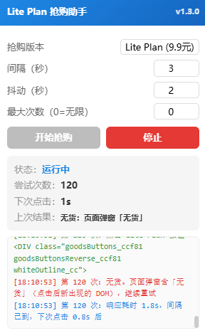

# 火山方舟 Coding Plan 抢购助手

一个油猴（Tampermonkey）脚本，自动循环点击火山方舟 Coding Plan 活动页的「立即订阅」按钮，帮你抢到限量的 Lite Plan（9.9 元/月）或 Pro Plan。

## 功能特性

- **版本可选**：面板下拉框切换 Lite Plan 或 Pro Plan
- **智能点击**：自动定位目标 Plan 卡片的订阅按钮，完整事件派发兼容 React 合成事件
- **真实反馈识别**：直接读取服务器响应体判断有无货，不依赖页面弹窗（静默返回也能识别）
  - 命中失败关键词（库存不足/无货/售罄...）→ 继续重试
  - 命中成功关键词（下单成功/订单创建...）或页面跳转 → 成功停止
  - 检测到验证码弹层 → 提示人工处理
- **合理计时**：间隔从「上次点击时刻」算起，响应未回来不抢点，日志显示响应耗时和下次点击倒计时
- **随机抖动**：默认 10 秒 ± 2 秒，避免固定节奏被识别为机器人
- **抢到提醒**：停止点击 + 红色边框闪烁高亮 + 蜂鸣声 + 弹窗，由你手动完成支付
- **悬浮控制面板**：可拖拽，支持开始/暂停、调整间隔/抖动/最大次数、实时状态与滚动日志
- **安全**：不自动提交订单、不处理登录、不绕过验证码，仅模拟人工点击

## 效果预览

## 使用方法

1. 安装 [Tampermonkey](https://www.tampermonkey.net/) 浏览器扩展
2. 新建脚本，粘贴 `volcengine-codingplan-lite-grabber.user.js` 全部内容并保存（或直接导入该文件）
3. 打开 https://www.volcengine.com/activity/codingplan 并**先登录**
4. 页面右上角出现控制面板，选择版本，点「开始抢购」
5. 抢到后会有声音和弹窗提醒，请手动完成支付

## 面板配置说明

| 配置项 | 默认值 | 说明 |
|--------|--------|------|
| 抢购版本 | Lite Plan | 可选 Lite Plan (9.9元) 或 Pro Plan |
| 间隔（秒） | 10 | 点击间隔，从上次点击时刻算起 |
| 抖动（秒） | 2 | 随机抖动，实际间隔 = 间隔 ± 抖动 |
| 最大次数 | 0 | 0 = 无限，设为正数则达到后自动停止 |

## 工作原理

1. **定位按钮**：用业务属性 `data-monitor-comp-topic="Lite Plan"` 精确定位目标卡片内的订阅按钮，三重容错（业务属性 → 文字匹配 → 可见性过滤）
2. **点击循环**：递归 `setTimeout`，每轮点击后开启响应采集窗口
3. **结果检测**：拦截 `fetch`/`XHR`，只捕获下单相关请求的响应体，扫描成功/失败关键词；同时用 `MutationObserver` 监听点击后新出现的弹窗
4. **计时逻辑**：下次点击 = max(上次点击 + 间隔, 响应结束 + 0.8s 缓冲)，既保持节奏又不抢点未完成的响应

## 风险提示

- 本脚本仅模拟人工点击，**不绕过任何支付/验证流程**
- 间隔过短可能触发风控，请保持合理间隔（默认 10 秒）
- 请在已登录状态下使用，脚本不处理登录
- 抢到后脚本只负责提醒，下单/支付需你手动完成

## 技术栈

- Tampermonkey UserScript
- 原生 JavaScript（无依赖）
- Web Audio API（蜂鸣提醒）
- MutationObserver + fetch/XHR 拦截

## 实际使用情况

> 截至目前，作者本人还没有成功蹲到货 😅

火山方舟 Coding Plan 的补货时间不固定，白天手动盯着不太现实。比较推荐的做法是：**晚上睡觉前打开页面、登录、点「开始抢购」，让脚本整夜自动循环点击**，运气好的话说不定就蹲到了。第二天早上起来第一件事先看一眼浏览器——如果抢到了会有醒目的弹窗和高亮提示，再手动完成支付即可。

如果一直提示「库存不足」，说明当天没有补货，第二天接着挂就行。祝大家都能抢到。

## License

MIT
